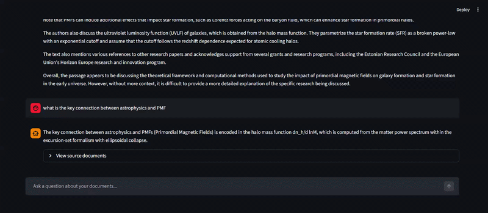

# DocChat — RAG Chatbot

> Ask questions about any PDF document using AI.
> Built with LangChain, Groq LLM, FAISS, and Streamlit.

[LIVE DEMO BADGE]  [Python Version]  [License]

## Demo
## Demo

## What it does
- Upload any PDF → it gets chunked and embedded locally
- Ask natural language questions → retrieves relevant context
- LLM generates answers citing exact source pages
- Source documents shown for every answer (no hallucination)

## Architecture
[INSERT SIMPLE FLOW DIAGRAM: PDF → Chunks → Embeddings → FAISS → Query → LLM → Answer]

## Tech Stack
| Component    | Tool                              | Why             |
|--------------|-----------------------------------|-----------------|
| LLM          | Groq (llama3-8b)                  | Free, fast      |
| Embeddings   | sentence-transformers/MiniLM-L6   | Runs locally    |
| Vector DB    | FAISS                             | No server needed|
| Framework    | LangChain                         | Industry standard|
| UI           | Streamlit                         | Fast prototyping |

## Run locally
git clone ...
pip install -r requirements.txt
cp .env.example .env   # add your Groq API key
streamlit run app.py

## What I learned
[2-3 sentences about challenges you solved — chunking strategy,
 prompt engineering, caching. THIS is what interviewers ask about]